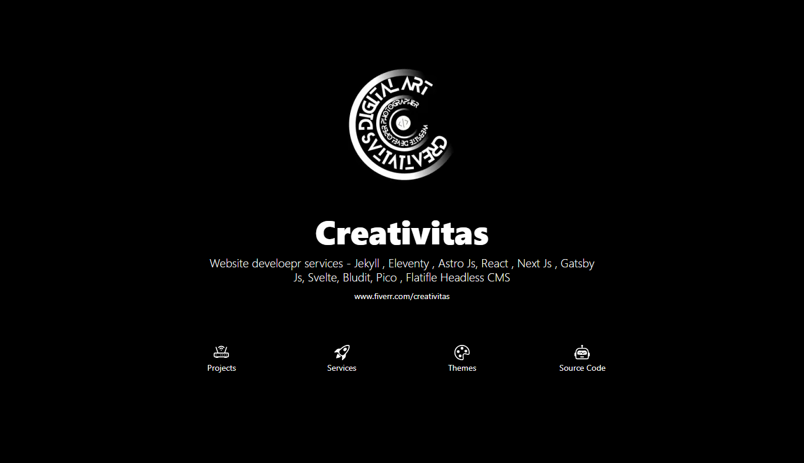

# Creativitas on Github

### A Protfolio website project

Learn how to develope your Jekyll website with YAML files.

Hire me

[https://www.fiverr.com/creativitas/](https://www.fiverr.com/creativitas/)

--------------

Shoot

Lighthouse Result

--------------

### How to :

+ Download source code project
+ Download ruby
+ Install this source code project `bundle install`
+ Run Project `jekyll serve` or `bundle exec jekyll serve`
+ Open `localhost:4000`
+ Change all with your needed, then push on your github repo for make your site live !!
+ More themes template [Explore all themes project →](https://www.hockeycomputindo.com/themes)

### Support us with buy me a coffee
[Buy A Coffee →](https://creativitaz.gumroad.com/l/coffee) or 
[By Paypall →](https://www.paypal.com/cgi-bin/webscr?cmd=_s-xclick&hosted_button_id=JVZVXBC4N9DAN)

--------------

[Explore all themes project →](https://www.hockeycomputindo.com/themes)

Hire me

[https://www.fiverr.com/creativitas/](https://www.fiverr.com/creativitas/)
